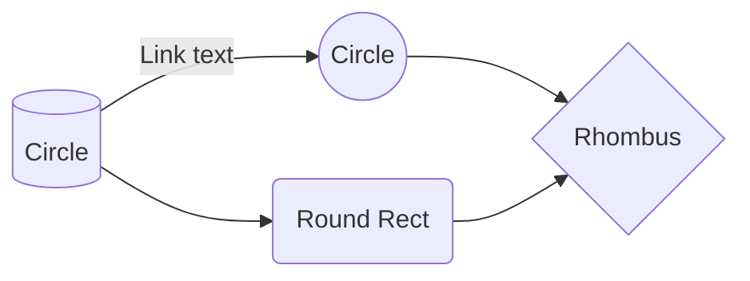

#Welcome to the DevTeam work method!

```mermaid
graph LR
A[(Circle)] -- Link text --> B((Circle))
A --> C(Round Rect)
B --> D{Rhombus}
C --> D
```

##Glossary of terms

##Discord integration with the DevTeam Work Method
